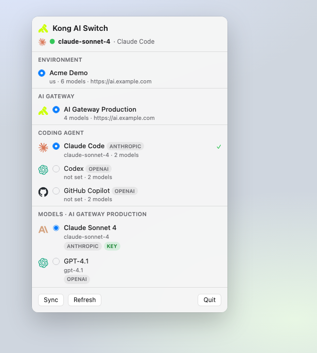

# kong-ai-switch

Switch Claude Code, Claude Desktop and Codex between the models your **Kong AI Gateway 2.0** serves, using Kong as the source of truth for what you are allowed to use.

<p align="center">
  
</p>

Inspired by [cc-switch](https://github.com/farion1231/cc-switch), which switches Claude Code between API vendors using a local list of providers. This tool replaces that local list with a live sync from Kong: the models you can switch to are the AI Models your platform team has published, with their policies, budgets and credentials already attached.

Built for engineers who work across several Konnect orgs. Your own org, a shared demo org, and each customer are named **environments**, so moving between them is one command rather than re-exporting shell variables.

```
$ kong-ai-switch env list
  ENVIRONMENT  REGION  PROXY URL                TOKEN     MODELS
* mine         us      http://localhost:8000    keychain  4
  acme-poc     eu      https://ai.acme.example  keychain  7

$ kong-ai-switch env use acme-poc
Active environment is now "acme-poc".

$ kong-ai-switch list
Environment: acme-poc

  MODEL      FORMAT     UPSTREAM         GATEWAY
* my-claude  anthropic  claude-opus-4-8  Acme Production

$ kong-ai-switch use my-claude
Switched Claude Code to "Claude Opus (prod)".
```

## Why route Claude Code through Kong

The API key never reaches the developer. Kong holds the upstream credential on the AI Model Provider entity and injects it, so rotating a vendor key touches one place rather than every laptop. In exchange you get token and cost accounting per team, rate limits and budgets, prompt guards and PII sanitisation, and failover across providers — all applied centrally to traffic the CLI is already sending.

## Download (macOS menu bar app)

Pre-built app (**v0.2.1**, Apple Silicon / ad-hoc signed):

- [GitHub Release v0.2.1](https://github.com/neojiang-kong/kong-ai-switch/releases/tag/v0.2.1) (recommended)
- [`dist/KongAISwitch-macOS.zip`](dist/KongAISwitch-macOS.zip)

Unzip, drag `KongAISwitch.app` into **Applications**, then open it. On first launch macOS may require **right-click → Open** (Gatekeeper) because the build is not Developer ID–notarized.

**Requirement:** [Node.js 20+](https://nodejs.org/) (`brew install node`). The CLI ships **inside the app** — no separate checkout or `npm install` needed.

To rebuild the zip yourself:

```bash
cd macapp && ./build-app.sh release
ditto -c -k --keepParent build/KongAISwitch.app ../dist/KongAISwitch-macOS.zip
```

## Requirements

- Node.js 20 or newer
- A Kong AI Gateway 2.0 instance in Konnect, with at least one AI Model
- A Konnect personal access token ([generate one](https://cloud.konghq.com/global/account/tokens))

No AI Gateway yet? Kong's quickstart provisions a control plane and a local data plane:

```bash
curl -Ls https://get.konghq.com/ai | bash -s -- -k $KONNECT_TOKEN
```

## Setup

Define an environment once:

```bash
kong-ai-switch env add mine \
  --region us \
  --proxy-url http://localhost:8000 \
  --token kpat_...
```

Then sync and switch:

```bash
kong-ai-switch sync
kong-ai-switch list
kong-ai-switch use my-claude
```

Restart Claude Code afterwards to pick up the change.

## Working across orgs

Add one environment per org. Each keeps its own region, data plane address, token and synced model list, so switching is instant and syncing one never disturbs another.

```bash
kong-ai-switch env add acme-poc --region eu --proxy-url https://ai.acme.example --token kpat_...
kong-ai-switch env use acme-poc     # make it the default
kong-ai-switch list --env mine      # or act on one without switching
```

To hand a setup to a teammate, export it. **Credentials are never included** — the file carries the region, proxy URL and gateway, and the recipient supplies their own token.

```bash
kong-ai-switch env export acme-poc --out acme.json
# teammate:
kong-ai-switch env import acme.json
kong-ai-switch env set acme-poc --token kpat_their_own
```

## Where your token is kept

On macOS, tokens go to the login Keychain, so they stay out of your dotfiles and out of anything that greps your home directory. Elsewhere, or if the Keychain refuses, they fall back to `~/.kong-ai-switch/config.json` with owner-only permissions. The CLI always tells you which of the two actually happened rather than implying a guarantee the platform did not give.

`KONNECT_TOKEN` overrides both when set, which is what CI should use. Run `kong-ai-switch env list` to see where each environment's token is coming from.

## Commands

| Command | What it does |
| --- | --- |
| `env add <name>` | Define an environment: `--region`, `--proxy-url`, `--token`, `--gateway` |
| `env list` | Show every environment, its token source and model count |
| `env use <name>` | Make an environment the default |
| `env show [<name>]` | Full detail for one environment |
| `env set <name>` | Change any field, including rotating the token |
| `env remove <name>` | Delete an environment, its token and its cached models |
| `env export <name>` | Write a shareable definition with no credentials |
| `env import <file>` | Add a shared definition, optionally renaming with `--name` |
| `discover --token <pat>` | Find gateways and their proxy URLs from a token alone |
| `agents` | Which coding agents are known, and where each points |
| `sync` | Pull the model catalogue for an environment |
| `list` | Show switchable models for an agent. `--agent codex` to scope it, `--all` to include unusable ones, `--json` for scripting |
| `use <model>` | Point an agent at a model. `--agent codex` or `--agent claude-code,codex` |
| `status` | Show where Claude Code points, and which environment it came from |

Every model command takes `--env <name>` to act on one environment without changing the active one.

## What it writes

Each agent has its own config file, and only the keys this tool owns are touched. Claude Code and Claude Desktop share `~/.claude/settings.json`; Codex gets a delimited block in `~/.codex/config.toml`, leaving the rest of that file verbatim.

For Claude Code, switching rewrites four keys under `env` and leaves everything else alone:

```json
{
  "env": {
    "ANTHROPIC_BASE_URL": "http://localhost:8000",
    "ANTHROPIC_MODEL": "my-claude",
    "ANTHROPIC_AUTH_TOKEN": "kong-ai-gateway",
    "CLAUDE_CODE_DISABLE_UNKNOWN_MODEL_WINDOW_ENFORCEMENT": "1"
  }
}
```

Your own settings and environment variables survive untouched. Writes are atomic, and a settings file that is not valid JSON is reported rather than overwritten.

## Three things worth knowing

**The model name you switch to is Kong's, not the vendor's.** An AI Model is a virtual model: `my-claude` may route to `claude-opus-4-8`, or load-balance across several providers. Send the upstream name and Kong will not route it. This tool always offers Kong's identifier, taking `config.route.model.values[0]` when an alias is set and the entity `name` otherwise.

**Each agent speaks one protocol, so the model list is scoped to it.** Claude Code and Claude Desktop speak the Anthropic Messages API; Codex speaks OpenAI. The same gateway can serve both, but a given AI Model is reachable only from agents matching its `formats[].type`. A model the selected agent cannot call is hidden from `list` and refused by `use`, with an explanation, rather than being offered as a switch that would 404.

The upstream vendor is unconstrained, because Kong translates: an AI Model with `formats[].type: anthropic` over a GPT-5 target works fine from Claude Code.

**The data plane address cannot always be discovered.** AI Gateway runs hybrid: Konnect manages the control plane, but data plane nodes run in your own infrastructure behind your own DNS. Kong's `proxy_urls` field is used when an operator has set it; otherwise supply `--proxy-url` or `KONNECT_PROXY_URL`. There is nothing to auto-detect.

## Which models are offered

A model appears in `list` when it is enabled in Kong, is a `model` type rather than a batch `api` type, declares the `generate` capability, serves a format the selected agent speaks, and has a reachable data plane address. Anything excluded is reported with a reason, so a missing model is never a silent mystery.

Models behind an AI Auth Strategy need a consumer credential, via `--token` or `KONG_AI_TOKEN`. That is separate from the Konnect token, which is used only to read the catalogue.

## Scope

Built and verified against the Konnect AI Gateway API (OAS 3.0, spec 2.0.3), for Claude Code, Claude Desktop and Codex CLI on Konnect-managed gateways.

Not covered: self-hosted Kong Gateway without Konnect, where AI Models do not exist as entities and discovery would mean enumerating `ai-proxy-advanced` plugins through the Admin API. Qwen Code CLI and GitHub Copilot would each reuse the same sync with their own config writer in `src/config/agents.js`.

## Development

```bash
npm test
```

## License

MIT. Inspired by [cc-switch](https://github.com/farion1231/cc-switch) by Jason Young, also MIT; this is an independent implementation rather than a code fork.
